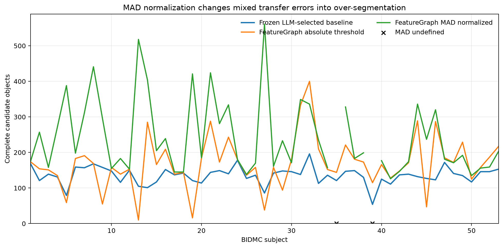

# From LLM-Proposed Analysis to Maintainable Behavioral Objects: A BIDMC Respiration Case Study

**Nazia Habib**
Draft research record, August 2026

## Abstract

Large language models (LLMs) can propose useful data analyses, but an LLM
interaction is not itself a durable computational representation. We study a
practical question: if LLM access disappeared, how much of an LLM-proposed
time-series analysis could a researcher continue to run, inspect, validate,
and maintain? A context-isolated LLM received one raw respiration record from
the BIDMC PPG and Respiration Dataset and produced a documented SciPy pipeline
and an object table of trough–peak–trough cycles. The researcher then encoded
an independently specified, deterministic transition representation in
FeatureGraph. On the development record, 169 of 169 complete LLM objects
matched FeatureGraph objects within 0.5 seconds; FeatureGraph produced five
additional complete candidates. Typical period and full-excursion
measurements agreed closely, while temporal symmetry remained sensitive to
different trough semantics.

We then froze the construction and evaluated transfer across all 53 BIDMC
records. The original absolute transition rule produced 8,960 complete
FeatureGraph objects and the frozen LLM-selected baseline produced 7,168;
6,200 objects matched, leaving 2,760 FeatureGraph-only and 968 baseline-only
objects. A second experiment normalized the directional difference by a
subject-level median absolute deviation (MAD), retaining a threshold
calibrated only on subject 1. MAD normalization increased baseline coverage on
the 51 records for which it was defined: matched objects increased from 6,030
to 6,850 and baseline-only objects fell from 963 to 143. This apparent recall
gain came with severe over-segmentation: FeatureGraph-only objects increased
from 2,671 to 5,553, and the normalized construction was undefined for two
records with zero difference MAD.

The study demonstrates successful preservation, deterministic execution,
object-level auditability, and explicit failure localization. It does not
demonstrate a generally transferable respiration detector. Determinism
preserved the researcher-specified representation; it did not supply the
missing judgment about which transitions constitute meaningful breaths. This
distinction motivates a transition-only next phase of FeatureGraph and
provides a candid research record of both the achieved capability and its
limits.

## 1. Introduction

The research question behind this study is: "If large language model (LLM) access were gone tomorrow, what could researchers maintain from their LLM-assisted analyses?" 

A researcher using an LLM for data analysis can produce useful results, but an LLM interaction is not a persistent computational representation of that analysis. Much of the output of the work exists in prompts, generated code, ad hoc parameter tuning, and both human and LLM interpretation that cannot be easily recreated to perform the analysis again without LLM assistance. If a researcher needed to run a similar study, they would need to consult the LLM again, or often design their own bespoke analysis that incorporated their own expertise and that might not be reproducible by others. 

FeatureGraph proposes a framework for deterministic preservation and repeatable execution of LLM-driven analysis. This preservation study's contributions are:

1. a reproducible handoff from a raw-data LLM analysis to an explicit,
   deterministic behavioral-object representation;
2. an object-level comparison that distinguishes genuine agreement from
   aggregate cancellation and definition mismatch;
3. a 53-subject transfer evaluation of the original absolute transition rule;
4. a second cohort experiment isolating the effect of subject-level MAD
   normalization; and
5. a capability ledger separating LLM proposal, researcher judgment,
   FeatureGraph execution, conventional signal-processing dependencies, and
   functionality preserved without continued LLM access.

## 2. Representation

An analysis of a sampled time-series signal can be decomposed into the following parts.

### 2.1 Observed data

This consists of:

- sampled values and their ordering.

### 2.2 Representation frame

This consists of:

- the physical units in which a signal is expressed;
- its sampling interval and temporal resolution;
- recording duration and coverage;
- normalization and smoothing applied to the signal; and
- sensor resolution and preprocessing.

The representation frame specifies the context that must be recorded to
interpret and compare measurements from the signal while retaining information
needed for analysis.

### 2.3 Construction contract

This consists of:

- rules that identify states, transitions, boundaries, and objects.

The FeatureGraph position is: if observed signal morphology can be described
in a contract that can then be used to identify corresponding characteristics
in multiple signals, the analytical procedure has become durable, inspectable,
and testable for transfer.

### 2.4 Measurement contract

This consists of:

- rules specifying how characteristics such as amplitude, rate of change,
  symmetry, and accumulation are calculated.

### 2.5 Construction and measurement contracts

FeatureGraph as described provides two contracts:

1. A construction contract that specifies states, transition events, boundaries, and objects. The vocabulary used to define states and transitions is deliberately kept small. It places defined limits on:
   
- the number of possible states that will be identified
- the number of transition events that will be identified
- the construction process for measured properties
  
2. A measurement contract that provides specifications for obtaining amplitude, rates of change, symmetry, accumulation, and other calculated properties of derived objects.

These two contracts preserve two different kinds of analytical decisions. The construction contract determines whether an object exists, its identify, its boudaries, its landmarks, and its membership in the set of objects. The measurement contract operates on the constructed object and determines how its properties are calculated.

The BIDMC study identified several areas where these contracts failed:

Construction contract:
- disagreements over accepted cycle and object boundaries

Measurement contract:
- half-range vs full-excursion amplitude difference, a definition that concerns the measurement contract. Amplitude needs to be defined consistently, which is part of the measurement contract

Both contracts:
- wave symmetry: its formula is a measurement choice but its value depends on boundary landmarks determined by the construction contract

### 2.6 Semantic or physical context

This consists of:

- what the signal represents;
- which physical mechanism produced it;
- what domain it belongs to; and
- what causal meaning and structure the engineer believes it contains.

Semantic context explicitly exists outside the scope of FeatureGraph.
FeatureGraph is not asked to understand what a signal means in the real world
to an observer or researcher. It may retain user-supplied labels and metadata,
but object construction does not depend on FeatureGraph inferring their
physical or domain meaning.

## Evaluation criteria

### 2.7 Durability, inspectability, and transfer

A representation system can convert analytical decisions that were implicit in an LLM-assisted workflow into an explicit, executable contract. The quality of the representation can be measured using the following criteria:

#### 2.7.1 Durability

Can the same declared analysis be executed later without the LLM? The analysis should produce reproducible objects from the constructed contract on frozen inputs.

#### 2.7.2 Inspectability

Can a human see and revise how states, boundaries, objects, and measurements were defined? A human should be able to modify and rerun the code, edit its assumptions and contract, and identify structural limitations with the representation.

#### 2.7.3 Transfer

Does the same contract produce useful objects on new data without case-specific modification? We can measure this in:

- whether the contract runs unchanged;
- whether it produces structurally valid objects; and
- whether those objects agree with an independent reference or annotation.

## 3. Related work

### 3.1 Reproducible computational research and provenance

This study belongs first to the reproducible-computation tradition. Peng
argues that computational results require a reproducible intermediate standard
when full independent replication is unavailable [5]. Sandve et al. turn that
principle into operational rules: retain how every result was produced, avoid
unrecorded manual transformations, archive exact software versions, and keep
the data underlying figures [6]. The FAIR principles broaden the target from
data alone to the algorithms, tools, and workflows that produce them [7].
FeatureGraph follows this line by freezing inputs, parameters, code, object
tables, unmatched cases, and environment metadata.

Workflow systems such as Nextflow make pipelines portable and repeatable [8],
while provenance systems such as noWorkflow recover execution history from
ordinary scripts without requiring a workflow language [9]. Those systems
primarily preserve *how computations executed*. The present work addresses a
complementary layer: preserving the analyst's temporal representation (what
constitutes a state, event, boundary, complete object, and property) so that a
human can inspect and revise the analytical contract rather than merely rerun
the same script. FeatureGraph is not proposed as a replacement for workflow,
environment, or provenance tooling; its object tables and construction records
are intended to compose with them.

### 3.2 LLM-assisted data analysis and human oversight

LLM-based analysis systems demonstrate that models can translate natural
language goals into executable analytical artifacts. LIDA, for example,
decomposes visualization generation into data summarization, goal generation,
code generation, execution, and filtering [10]. WaitGPT exposes generated
analysis code as an interactive visual representation so users can monitor,
verify, and steer individual operations [11]. These systems emphasize access,
generation, and oversight during an active model interaction.

Our question begins after such an interaction: what remains when the model is
unavailable, its conversational context is gone, or a researcher must maintain
the analysis without asking the model to reconstruct its reasoning? The unit of
preservation is therefore not the chat transcript or prose answer. It is a
versioned contract plus executable construction and object-level evidence. The
LLM is neither treated as an oracle nor evaluated as a general-purpose agent;
it is one source of an analytical proposal that must be converted into a
reviewable artifact.

### 3.3 Explicit representation and abstraction

FeatureGraph was also influenced by work that treats representation as central
to generalization. Chollet's formulation of intelligence and the Abstraction
and Reasoning Corpus (ARC) separate task-specific skill from skill-acquisition
and generalization under declared priors [12]. ARC is not a time-series method
and is not an empirical baseline in this study. Its relevance is conceptual:
successful reasoning depends on constructing useful objects, relations, and
transformations rather than only reproducing an output.

This study applies that motivation narrowly. Raw samples are converted into
declared transition states, boundary events, bounded objects, properties, and
relations. Transfer is then tested rather than assumed. The negative cohort
result is important under this view: an explicit representation can be
inspectable and reproducible while still encoding a development-record rule
that generalizes poorly. FeatureGraph's contribution is the durable,
auditable representation layer, not evidence of abstract reasoning or an
autonomous discovery system.

### 3.4 Time-series representations

Time-series research contains many alternative representations designed for
particular downstream tasks. Symbolic Aggregate approXimation (SAX) reduces a
real-valued sequence to a lower-dimensional symbolic string while preserving a
lower bound on distance for indexing and mining [13]. Shapelets identify
discriminative subsequences that can support interpretable classification [14].
Both demonstrate that the choice of representation determines which operations
and comparisons become tractable.

FeatureGraph differs in objective. It does not seek a compact global encoding
or a discriminative subsequence classifier in this experiment. It constructs a
relational table of temporally bounded candidate objects with explicit starts,
events, ends, completeness, properties, and parent/child relations. Nor is it a
new peak-detection algorithm: the state rule that creates candidate boundaries
is supplied by the researcher. The evaluation therefore asks whether this
object representation preserves and exposes an analysis, and separately
whether the supplied boundary rule transfers.

## 4. Data and study scope

### 4.1 BIDMC study motivation

The BIDMC respiration data were selected because they offer 53 public,
eight-minute recordings, a fixed 125 Hz sampling rate, visible repeated
waveform structure, and two independent manual breath-annotation series. The
researcher did not begin with domain expertise in respiratory physiology.
This made the dataset appropriate for studying analytical preservation and
representation, but it also limits the interpretation: this is not a clinical
validation study and no detected quantity is claimed to measure calibrated
airflow or volume.

### 4.2 Dataset and evaluation scope

The [BIDMC PPG and Respiration Dataset](https://physionet.org/content/bidmc/1.0.0/)
contains 53 recordings extracted from critically ill patients, with
physiological signals sampled at 125 Hz and two sets of manually annotated
breath sample numbers. Each record is approximately eight minutes long. This
study uses the impedance respiration waveform and the two annotation columns.

Subject 1 served as the development record. The initial LLM analysis,
FeatureGraph construction, threshold selection, and object-contract
harmonization were performed on this record. Subjects 2–53 were initially
treated as a frozen transfer cohort. The later MAD experiment reused the
subject-1 calibration and applied one rule to every record; no threshold was
selected separately for an evaluation subject.

The annotations were not used to construct objects or tune individual
boundaries. They were consulted after construction as an external diagnostic.
The frozen LLM-selected detector was likewise treated as a comparison path,
not as ground truth. The object-level results therefore measure agreement
among explicit constructions and annotations rather than clinical detection
accuracy.

## 5. Methods

### 5.1 Development-versus-transfer protocol

The study uses phase labels that constrain the claims that can be made from
each result.

| Phase | Records | Permitted activity | Evidential status |
| --- | --- | --- | --- |
| Exploratory development | Subject 1 | Inspect waveform; choose and revise contracts; harmonize measures; debug boundaries | Generates hypotheses and implementation; no transfer claim |
| Frozen absolute transfer | Subjects 2–53 | Run the locked LLM baseline and locked FeatureGraph absolute rule; no per-subject tuning or correction | Primary evidence about transfer of the original representation |
| Post-transfer diagnosis | Subjects 1–53, with paired reporting on the 51 MAD-valid records | Test the single subject-1-calibrated MAD normalization and subject-5 hysteresis diagnostic | Ablation explaining failures; not independent validation |
| Future confirmatory evaluation | New declared split or external dataset | Freeze the transition-only contract before opening the test outcomes | Required for a confirmatory transfer claim |

The absolute FeatureGraph rule and the frozen LLM/SciPy baseline were locked
after subject 1. Subjects 2–53 were processed without subject-specific
parameters, manual boundary changes, or annotation-guided corrections.
Annotations were used only after construction for diagnosis. The MAD rule was
conceived after the absolute transfer failures had been observed. Although its
threshold was calibrated only from subject 1 and then shared, its evaluation
uses previously examined records; it is therefore explicitly post hoc. The
subject 5 hysteresis pass is an even narrower diagnostic and is not a cohort
result.

This protocol prevents three invalid substitutions: development agreement is
not transfer, agreement with the frozen baseline is not clinical accuracy, and
post hoc improvement is not independent confirmation. A future study should
declare development, optional validation, and untouched test records before
parameter selection; record every attempted construction; and publish the
locked contract before computing final test metrics.

### 5.2 Blinded raw-data LLM path

A context-isolated LLM received only the subject 1 waveform, its 125 Hz
sampling rate, a required object schema, and a measurement contract. It was
instructed not to use or search for FeatureGraph results. The LLM selected:

1. a fourth-order Butterworth low-pass filter at 0.8 Hz, applied with
   zero-phase forward/backward filtering;
2. `scipy.signal.find_peaks` on the filtered signal and its negation;
3. minimum peak distance of 188 samples and prominence of 0.08; and
4. complete cycles defined as consecutive troughs containing exactly one
   peak.

The LLM returned 169 complete objects and one trailing incomplete fragment.
Its method, libraries, parameters, endpoint rules, and output object table
were saved. A conventional Python function now reproduces this frozen method
without consulting an LLM. SciPy remains a dependency of this comparison path;
its peak-distance and prominence constraints are established signal-processing
operations rather than FeatureGraph behavior.

The exact model/session metadata for the proposal interaction was not retained
in the experiment directory. Consequently, this study claims reproducibility
of the frozen method and outputs, not reproducibility of the original model's
decision to select that method.

### 5.3 FeatureGraph object construction

Let `x_t` be the respiration value at sample `t`. The original native
FeatureGraph construction computes

$$
d_t = x_t - x_{t-45}
$$

and defines the rising state as

$$
R_t = \mathbf{1}(d_t > 0.15).
$$

Internally bounded non-rising gaps of at most seven samples are closed. An
entry into the rising state creates a candidate trough event; an exit creates
a candidate peak event at the preceding sample. Cumulative trough-entry
events assign wave identifiers. A complete object requires a strictly ordered
trough, peak, and subsequent trough and cannot be the final boundary-truncated
wave. Endpoint fragments remain represented with `is_complete=False`.

These rules do not assert that the signal is truly oscillatory or that every
candidate event is a breath. They state exactly how the researcher chose to
partition this waveform into transition-derived objects.

### 5.4 Measurement contracts

For a complete object with start `b`, peak `p`, and end `e`:

- period is the distance between consecutive peak indices divided by 125;
- full excursion is the raw within-object maximum minus minimum;
- FeatureGraph radius amplitude is half the full excursion; and
- temporal symmetry is

$$
1 - \frac{|(p-b)-(e-p)|}{e-b},
$$

which is bounded in `[0,1]`.

The first corrected notebook comparison had reported FeatureGraph radius
amplitude against the LLM's full excursion and a historical symmetry value
using an incompatible definition. These values were not treated as
disagreements after the contracts were identified. The object-level
comparison uses the harmonized full-excursion and bounded-symmetry formulas.

### 5.5 Object and annotation matching

Complete FeatureGraph and LLM objects were sorted by peak index and matched
one-to-one in temporal order within 63 samples (approximately 0.5 seconds).
The dynamic-programming matcher maximizes the number of ordered matches and
then minimizes total absolute peak error. Unmatched objects are retained in
separate audit tables.

Candidate peaks from each detector were independently matched to both BIDMC
annotation series under the same tolerance. Each detected and annotated peak
could be used at most once. Annotation agreement was summarized in both
directions: the fraction of detected peaks matched and the fraction of
annotated peaks recovered.

### 5.6 Frozen absolute-threshold cohort

The subject 1 construction (no smoothing, lag 45, threshold 0.15, and maximum
state gap 7) was applied unchanged to all 53 subjects. The frozen LLM-selected
SciPy method was also applied unchanged to all records. No subject-specific
parameters or manual boundary corrections were introduced.

### 5.7 MAD-normalized cohort

The second experiment tested whether subject-level waveform scale explained
the transfer failures. For each subject,

$$
s = \mathrm{median}(|d_t - \mathrm{median}(d)|)
$$

and

$$
z_t = d_t / s.
$$

Subject 1 supplied the only calibration:

$$
k = 0.15 / s_1 = 0.807624.
$$

The rising state for every subject was then `z_t > k`. All other boundary,
gap, completeness, measurement, matching, and annotation rules remained
unchanged. Raw respiration values were preserved and used for amplitude and
full-excursion measurements.

The MAD experiment was an ablation of scale normalization, not a new tuning
exercise. Hysteresis was excluded so that only the normalization changed.
When MAD equaled zero, the construction was declared undefined; no arbitrary
fallback scale was substituted.

## 6. Results

### 6.1 Development-record agreement

On subject 1, native FeatureGraph produced 174 complete objects and the
blinded LLM path produced 169. All 169 LLM objects matched FeatureGraph
objects; FeatureGraph had five unmatched complete candidates and the LLM had
none. Median absolute peak error was 10 samples (0.080 seconds), with a maximum
of 29 samples (0.232 seconds).

| Matched-object measure | FeatureGraph | LLM path | Agreement |
| --- | ---: | ---: | --- |
| Complete objects | 174 | 169 | 169 matched; 5 FeatureGraph-only |
| Mean period | 2.802 s | 2.821 s | Median absolute error 0.040 s |
| Mean full excursion | 0.896 | 0.903 | Median absolute error 0.00489 |
| Mean temporal symmetry | 0.596 | 0.844 | Median absolute error 0.250 |

The result supports genuine agreement on the principal repeated objects,
period, and excursion. Symmetry does not agree comparably because the
transition rule and filtered local-extrema rule place trough boundaries
differently. This is a boundary-semantics mismatch, not an arithmetic or unit
mismatch.

### 6.2 Original absolute-threshold transfer

Across all 53 subjects, the native absolute rule produced 8,960 complete
objects and the frozen LLM path produced 7,168. Of these, 6,200 matched.

| Absolute construction, subjects 1–53 | Result |
| --- | ---: |
| FeatureGraph complete objects | 8,960 |
| LLM-baseline complete objects | 7,168 |
| Matched objects | 6,200 |
| FeatureGraph-only objects | 2,760 |
| Baseline-only objects | 968 |
| FeatureGraph matched fraction | 69.2% |
| Baseline matched fraction | 86.5% |

On the frozen subjects 2–53, FeatureGraph produced 8,786 objects, the
baseline produced 6,999, and 6,031 matched. Median subject-level matched
fractions were 78.5% of FeatureGraph objects and 99.1% of baseline objects.
Peak placement for matched objects remained close (median absolute difference
12 samples), but transfer was uneven. Some records were heavily
over-segmented, while subjects including 5, 13, 19, 27, and 45 were severely
under-detected. Thus the absolute threshold did not fail in one uniform way.

### 6.3 MAD normalization versus the original run

MAD normalization was defined for 51 of 53 records. Subjects 35 and 39 had
zero 45-sample difference MAD and were excluded from MAD aggregates. The
original absolute construction remained defined for both; it produced 144
versus 121 baseline objects on subject 35 and 115 versus 54 on subject 39.

The table below compares both constructions on the same 51 valid records.

| Measure, same 51 subjects | Absolute | MAD normalized |
| --- | ---: | ---: |
| FeatureGraph complete objects | 8,701 | 12,403 |
| LLM-baseline complete objects | 6,993 | 6,993 |
| Matched objects | 6,030 | 6,850 |
| FeatureGraph-only objects | 2,671 | 5,553 |
| Baseline-only objects | 963 | 143 |
| FeatureGraph objects matched | 69.3% | 55.2% |
| Baseline objects matched | 86.2% | 98.0% |
| Median subject absolute count error | 33 | 67 |
| Subjects over baseline count | 44 | 51 |
| Subjects under baseline count | 7 | 0 |
| Median absolute peak error | 12 samples | 13 samples |
| Median absolute period error | 0.080 s | 0.168 s |
| Median absolute full-excursion error | 0.0000 | 0.0020 |
| Median absolute symmetry error | 0.347 | 0.274 |

MAD normalization recovered more of the baseline on 27 subjects and never
reduced the number of matched baseline objects. This was particularly visible
in several original under-detection cases: subject 13 increased from 9 to 105
matched objects, subject 19 from 12 to 121, subject 27 from 7 to 86, and
subject 45 from 3 to 127. However, the total candidate counts on these records
became 518, 421, 561, and 237, respectively. Only 11 subjects moved closer to
the baseline count; 37 moved farther away, with three unchanged.

Annotation comparisons show the same recall–precision tradeoff. On the common
51 records, the fraction of annotated peaks recovered increased from 83.3% to
95.6% for annotator 1 and from 84.5% to 97.7% for annotator 2. The fraction of
FeatureGraph detections matched to annotations fell from 67.1% to 54.0% and
from 68.9% to 56.0%, respectively.

MAD normalization therefore addressed one real weakness, scale-dependent
under-detection, but did not produce a transferable peak-selection rule. It
converted a mixed failure pattern into systematic over-segmentation, worsened
period agreement, and was mathematically undefined on two quantized records.



**Figure 1.** Complete candidate-object counts for the frozen LLM-selected
baseline, the original FeatureGraph absolute threshold, and MAD-normalized
FeatureGraph. Missing MAD values at subjects 35 and 39 denote undefined zero
difference scales, not zero detected objects.

### 6.4 Hysteresis diagnostic

An exploratory subject 5 ablation retained the MAD-normalized entry threshold
and lowered the exit threshold from `1.0k` through `0.0k`. Complete candidates
fell only from 388 to 365, while annotation match counts did not improve. This
indicates that most extra candidates result from repeated threshold re-entry,
not brief flicker within a neutral band. Because this diagnostic did not solve
the transfer problem, hysteresis was not included in the full MAD cohort.

## 7. Capability and dependency ledger

| Capability | Source during development | Preserved without live LLM access? |
| --- | --- | --- |
| Propose filtering and peak detector | LLM | The chosen method is preserved; proposing a new one is not |
| Select domain-relevant peaks | Researcher/LLM judgment | Only as frozen explicit rules; not inferred by FeatureGraph |
| Execute LLM-selected baseline | NumPy, pandas, SciPy | Yes |
| Construct rising/falling states | FeatureGraph from researcher parameters | Yes |
| Expose trough/peak events and wave IDs | FeatureGraph | Yes |
| Retain incomplete endpoint objects | FeatureGraph | Yes |
| Summarize period, excursion, symmetry | Frozen measurement contracts | Yes |
| Match and audit individual objects | Deterministic comparison code | Yes |
| Diagnose transfer failures across subjects | Saved object and annotation tables | Yes |
| Invent a transferable detector automatically | Not achieved | No |
| Establish clinical validity | Requires domain expertise and clinical protocol | No |

The preserved functionality is substantial. Both frozen paths can run without
an LLM, produce object tables, expose disagreements, and support continued
maintenance by a human researcher. The study also clarifies what was not
replaced: the judgment required to decide which observed transitions should
count as meaningful objects in a new record or domain.

## 8. Discussion

The subject 1 result alone could have supported an overly optimistic claim.
Aggregate counts, rates, periods, and excursions were close, and every LLM
object matched a FeatureGraph object. The cohort experiments reveal why
object-level and multi-subject validation are necessary. A rule can preserve
one analysis faithfully and still fail to transfer.

This does not make the representation unsuccessful. FeatureGraph's role is
separable from detector quality. It deterministically transformed a declared
state rule into inspectable events, identities, complete and incomplete
objects, properties, and audit tables. When the absolute threshold failed,
the failure was visible by subject and object. When MAD normalization shifted
the failure from under-detection to over-segmentation, that tradeoff was
measurable rather than hidden in a narrative summary. When normalization was
undefined, the pipeline rejected the records instead of silently inventing a
scale.

The study therefore supports a narrower but defensible claim: an
LLM-assisted analysis can be converted into a durable computational artifact
whose behavior humans can inspect and maintain after LLM access is lost.
FeatureGraph can preserve the representation and its execution, but it does
not automatically preserve or reproduce all analytical intelligence that led
to the representation.

This distinction also changes the preferred architectural direction. The
current alpha packages the transition rules into an `Oscillation`
construction, even though the software cannot know whether a signal is an
oscillation. A transition-only representation would describe exactly what the
deterministic layer observes: state entries, exits, persistence, boundaries,
and relations among transitions. Higher-order interpretations such as
oscillation or respiration cycle could then be supplied by users or other
systems as compositions over those objects. The failures in this study are
evidence for that separation.

## 9. Threats to validity

### 9.1 Construct validity

The primary construct is *preservation of an analysis*, operationalized as the
ability to rerun explicit construction and measurement contracts, inspect
object boundaries, and reproduce saved tables without live LLM access. This
does not measure preservation of the LLM's latent reasoning, autonomous
semantic understanding, or ability to invent a new detector. Agreement with
the frozen LLM/SciPy path is also not respiratory ground truth. The two manual
annotation series provide an external diagnostic, but annotators differ and
may encode peak semantics that differ from either constructed object type.

Period and full excursion have harmonized contracts; trough-sensitive symmetry
does not have equivalent boundary semantics across detectors. Reporting that
quantity alongside period risks overstating disagreement in the summarized
object itself. We therefore interpret symmetry as a boundary-semantic
diagnostic, not a validated physiological property. Likewise, accumulation is
area over a normalized waveform baseline and cannot be interpreted as
calibrated respiratory volume.

### 9.2 Internal validity

Subject 1 was inspected repeatedly while parameters, endpoint rules, and
measurement contracts were developed. Its agreement statistics are therefore
development results and are vulnerable to researcher degrees of freedom. The
absolute transfer pass reduces this threat by locking both paths before
subjects 2–53 and prohibiting per-subject correction. The matching tolerance
and dynamic-programming objective were also declared in code, but alternative
tolerances or matching objectives could change unmatched counts; saved audit
tables make that sensitivity testable.

The MAD construction was proposed after observing absolute-rule failures, and
the subject 5 hysteresis test followed inspection of a specific failure. These
are post hoc diagnostics. They can identify mechanisms and motivate the next
design, but they cannot provide an unbiased estimate of future transfer.

### 9.3 External validity

BIDMC contains 53 short recordings from critically ill patients, all sampled
at 125 Hz and distributed through one dataset. Results may not generalize to
other sensors, sampling rates, preprocessing conventions, populations, or
longer recordings. The researcher lacked respiration-domain expertise, which
helped expose how much semantic judgment the representation required but
precludes clinical or physiological claims. A new dataset and domain review
are required before using these objects as breath measurements.

The study evaluates one LLM-proposed SciPy method and one FeatureGraph
representation. It does not estimate variation across models, prompts,
sessions, or human implementers. The original exploratory chat is unavailable,
and the context-isolated proposal session lacks exact model/session metadata.
Consequently, the frozen method is reproducible, while the act of proposing it
is not.

### 9.4 Conclusion and statistical validity

The object counts are a census of the selected BIDMC records rather than a
sample used for population inference; no clinical confidence intervals or
hypothesis tests are claimed. Aggregate agreement can conceal offsetting
errors, so the study reports one-to-one matches, unmatched objects, per-subject
counts, boundary errors, and annotation agreement in both directions. The MAD
comparison is restricted to the same 51 valid records; subjects 35 and 39 are
reported separately rather than silently dropped.

The frozen baseline is a comparator, not a gold standard. Terms such as
"recall" and "precision" are avoided for baseline matching unless the
denominator is stated, and annotation matches are described as agreement rather
than clinical sensitivity or positive predictive value.

### 9.5 Reproducibility and provenance validity

The repository preserves prompts, raw inputs, returned object tables, a written
method, deterministic reproduction code, construction parameters, tests, and
generated comparisons. This supports computational reproduction of the frozen
method and all reported tables. It does not recover the undocumented original
conversation or prove that another model would choose the same analysis.
Software and data services may also change; the tagged release, Zenodo archive,
checksums, and environment records reduce but do not eliminate that risk.

Finally, computational cost savings are not yet quantified. Deterministic
execution is expected to be cheaper and more stable than repeated LLM analysis,
but a defensible comparison requires fixed tasks, recorded runtimes, hardware,
model usage, and contemporaneous pricing or energy measurements.

## 10. AI-use disclosure

AI use occurred in three distinct roles and is reported separately so that an
undocumented conversation is not conflated with a reproducible method.

1. **Original exploratory interaction.** An earlier LLM conversation helped
   propose and interpret the initial respiration analysis. That conversation
   was not retained. Its transcript, exact model identifier, system configuration, and
   sampling settings are unavailable. It is historical motivation only and is
   not treated as reproducible evidence.
2. **Context-isolated frozen proposal.** A later LLM session received the
   archived subject 1 waveform, sampling rate, object schema, and frozen prompt,
   without FeatureGraph outputs. Its returned object table and written SciPy
   method were archived. Exact model/session metadata were not retained, so the
   model's choice of method cannot be replayed exactly. However, the selected
   method was translated into deterministic Python, and its saved outputs are
   reproduced and tested without an LLM. In this paper, *reproducible frozen
   method* refers to that code-level reproduction, not regeneration of the
   original LLM response.
3. **Research and writing assistance.** LLM tools assisted with code development, debugging, experiment orchestration, literature discovery, editorial feedback, formatting, and consistency checking. The author formulated the research question and conceptual framework, made the study-design decisions, selected and approved the construction and measurement contracts and parameters, executed and inspected the analyses, wrote and revised the manuscript’s substantive narrative, verified the reported claims against saved artifacts, determined the interpretation of the results, and accepts responsibility for all claims and conclusions.


AI-generated suggestions were not accepted as evidence merely because they
were produced by a model. Numerical claims are tied to versioned scripts and
tables; literature claims are tied to cited sources; and known gaps in AI
provenance remain disclosed rather than reconstructed retrospectively. The
full experiment-level disclosure is maintained in
`experiments/bidmc_llm_capture/AI_USE_DISCLOSURE.md`.

## 11. Conclusion

This study began with the question of what would remain if LLM access were
lost. The answer is neither “nothing” nor “the entire analytical capability.”
The LLM-proposed method, researcher-defined representation, deterministic
object construction, measurement contracts, and object-level audits now run
without an LLM. Humans can inspect their states and boundaries, reproduce
their outputs, and identify exactly where they fail.

What did not transfer was the rule for deciding which candidate transitions
should be treated as meaningful breaths. The absolute threshold failed
unevenly across subjects. MAD normalization recovered most baseline objects
but produced severe systematic over-segmentation and failed mathematically on
two records. Hysteresis did not repair the problem. These are not incidental
exceptions to conceal; they are the main scientific result about the boundary
between deterministic preservation and analytical judgment.

The next phase will therefore retain this study as a completed research
record and move FeatureGraph toward transition-only objects. That architecture
better matches what the system can claim: it can represent explicit temporal
changes faithfully, while leaving higher-order semantic interpretation to a
declared human or computational layer.

## 12. Reproducibility

The repository stores the blinded prompt, LLM method record, raw and object
tables, frozen reproduction code, subject-level comparisons, unmatched-object
audits, annotation comparisons, MAD failures, and paired scaling deltas.

```bash
PYTHONPATH=. python experiments/bidmc_llm_capture/multi_subject_comparison.py \
  --subjects 1-53 --jobs 4 --scaling absolute \
  --output-directory experiments/bidmc_llm_capture/results/multi_subject

PYTHONPATH=. python experiments/bidmc_llm_capture/multi_subject_comparison.py \
  --subjects 1-53 --jobs 4 --scaling mad \
  --output-directory experiments/bidmc_llm_capture/results/mad_multi_subject

PYTHONPATH=. python \
  experiments/bidmc_llm_capture/compare_scaling_runs.py
```

## References

1. Pimentel, M. A. F., Johnson, A. E. W., Charlton, P. H., and Clifton,
   D. A. *BIDMC PPG and Respiration Dataset*, version 1.0.0. PhysioNet,
   2018. [https://doi.org/10.13026/C2208R](https://doi.org/10.13026/C2208R).
2. Pimentel, M. A. F., Johnson, A. E. W., Charlton, P. H., Birrenkott, D.,
   Watkinson, P. J., Tarassenko, L., and Clifton, D. A. “Toward a Robust
   Estimation of Respiratory Rate From Pulse Oximeters.” *IEEE Transactions
   on Biomedical Engineering* 64(8), 1914–1923, 2017.
   [https://doi.org/10.1109/TBME.2016.2613124](https://doi.org/10.1109/TBME.2016.2613124).
3. Virtanen, P. et al. “SciPy 1.0: Fundamental Algorithms for Scientific
   Computing in Python.” *Nature Methods* 17, 261–272, 2020.
   [https://doi.org/10.1038/s41592-019-0686-2](https://doi.org/10.1038/s41592-019-0686-2).
4. Habib, N. *FeatureGraph*, version 0.1.0a2, 2026.
   [https://doi.org/10.5281/zenodo.21939319](https://doi.org/10.5281/zenodo.21939319).
5. Peng, R. D. “Reproducible Research in Computational Science.” *Science*
   334(6060), 1226–1227, 2011.
   [https://doi.org/10.1126/science.1213847](https://doi.org/10.1126/science.1213847).
6. Sandve, G. K., Nekrutenko, A., Taylor, J., and Hovig, E. “Ten Simple
   Rules for Reproducible Computational Research.” *PLOS Computational
   Biology* 9(10), e1003285, 2013.
   [https://doi.org/10.1371/journal.pcbi.1003285](https://doi.org/10.1371/journal.pcbi.1003285).
7. Wilkinson, M. D. et al. “The FAIR Guiding Principles for Scientific Data
   Management and Stewardship.” *Scientific Data* 3, 160018, 2016.
   [https://doi.org/10.1038/sdata.2016.18](https://doi.org/10.1038/sdata.2016.18).
8. Di Tommaso, P. et al. “Nextflow Enables Reproducible Computational
   Workflows.” *Nature Biotechnology* 35, 316–319, 2017.
   [https://doi.org/10.1038/nbt.3820](https://doi.org/10.1038/nbt.3820).
9. Murta, L., Braganholo, V., Chirigati, F., Koop, D., and Freire, J.
   “noWorkflow: Capturing and Analyzing Provenance of Scripts.” In
   *Provenance and Annotation of Data and Processes*, 71–83, 2014.
   [https://doi.org/10.1007/978-3-319-16462-5_6](https://doi.org/10.1007/978-3-319-16462-5_6).
10. Dibia, V. “LIDA: A Tool for Automatic Generation of Grammar-Agnostic
    Visualizations and Infographics Using Large Language Models.” In
    *Proceedings of ACL 2023: System Demonstrations*, 113–126, 2023.
    [https://doi.org/10.18653/v1/2023.acl-demo.11](https://doi.org/10.18653/v1/2023.acl-demo.11).
11. Xie, L., Zheng, C., Xia, H., Qu, H., and Zhu-Tian, C. “WaitGPT:
    Monitoring and Steering Conversational LLM Agent in Data Analysis with
    On-the-Fly Code Visualization.” In *UIST 2024*, 2024.
    [https://doi.org/10.1145/3654777.3676374](https://doi.org/10.1145/3654777.3676374).
12. Chollet, F. “On the Measure of Intelligence.” arXiv:1911.01547, 2019.
    [https://doi.org/10.48550/arXiv.1911.01547](https://doi.org/10.48550/arXiv.1911.01547).
13. Lin, J., Keogh, E., Wei, L., and Lonardi, S. “Experiencing SAX: A Novel
    Symbolic Representation of Time Series.” *Data Mining and Knowledge
    Discovery* 15, 107–144, 2007.
    [https://doi.org/10.1007/s10618-007-0064-z](https://doi.org/10.1007/s10618-007-0064-z).
14. Ye, L. and Keogh, E. “Time Series Shapelets: A New Primitive for Data
    Mining.” In *KDD 2009*, 947–956, 2009.
    [https://doi.org/10.1145/1557019.1557122](https://doi.org/10.1145/1557019.1557122).
