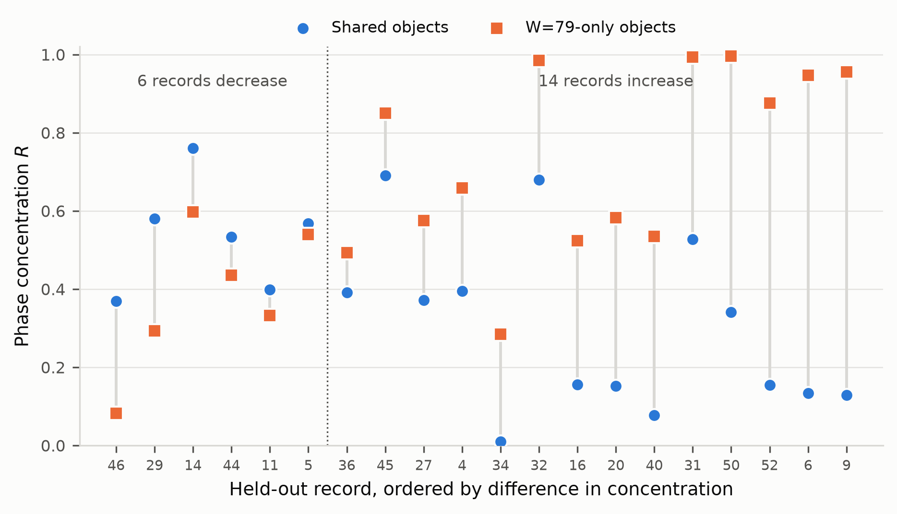
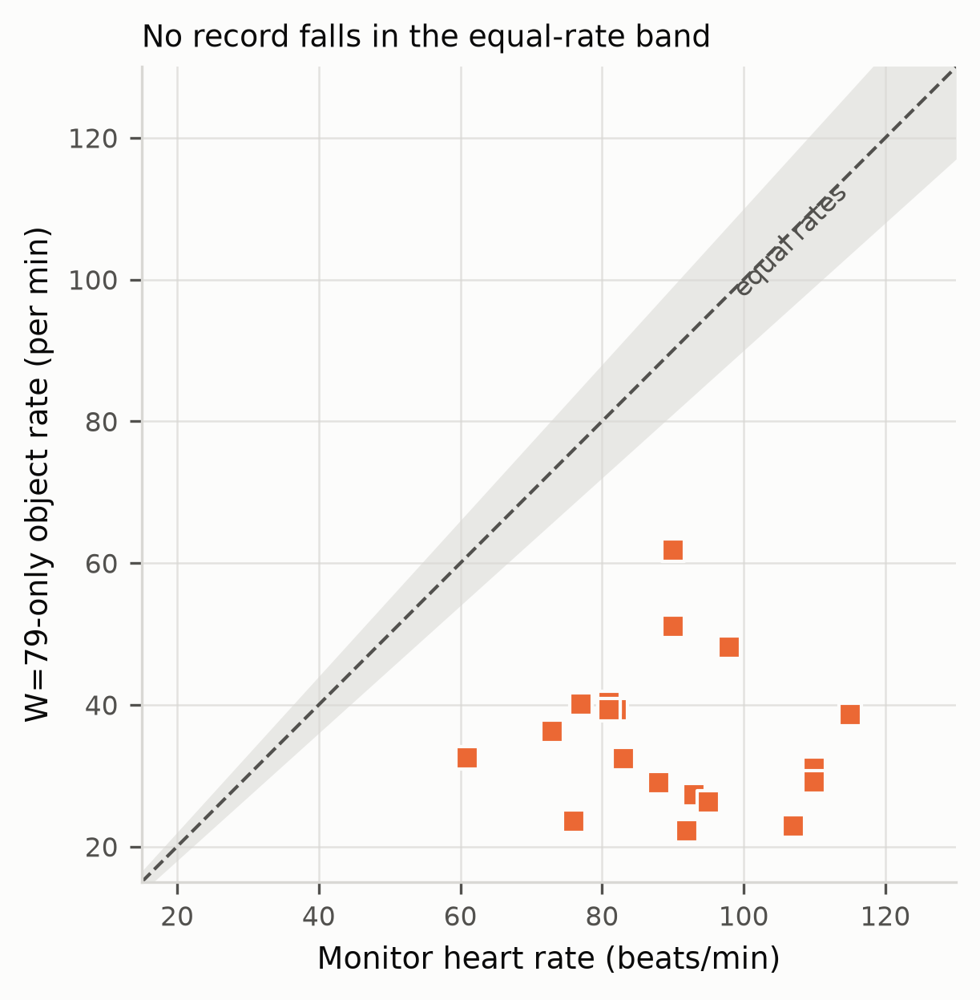
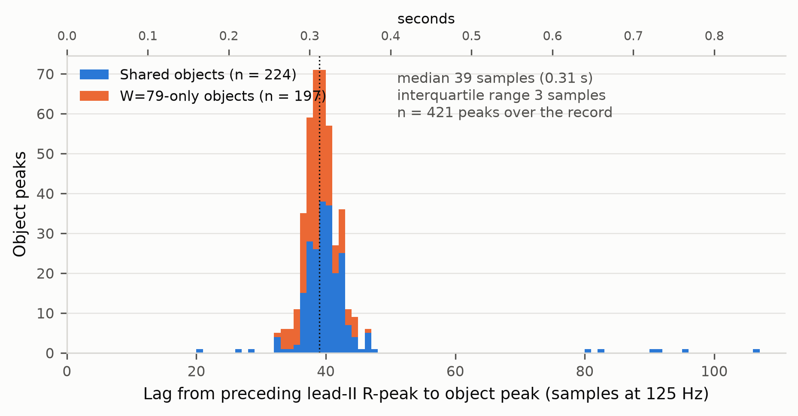
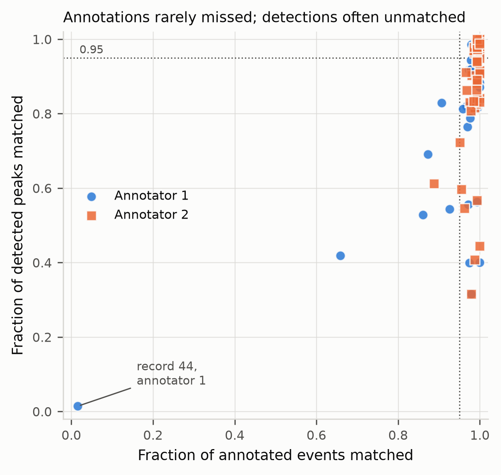

# Abstract

Time-series studies commonly fix preprocessing parameters without stating what
variation those parameters suppress and what they preserve. We treat the
temporal scale of a rolling envelope as part of a study's specification rather
than as a cleaning step, and ask what changing it does to the objects a
deterministic construction produces.

Using all 53 records of the BIDMC PPG and Respiration Dataset, we constructed
trough-peak-trough respiratory objects at rolling-envelope scales of 79 and 100
samples under a contract frozen after inspecting four development records. The
shorter scale produced 8,780 complete objects and the longer 7,926. Matching
across scales gave 7,918 shared objects, 862 constructed only at 79 samples,
and 8 constructed only at 100. Shortening the window adds objects and almost
never removes them.

On the 49 held-out records we tested whether objects introduced by the shorter
scale occupy more consistent positions in the cardiac cycle than objects both
scales construct. Forty-one records passed prespecified ECG validation and 20
supplied enough objects of both classes. The median difference in circular
phase concentration was 0.269 and was positive in 14 of the 20 records, with an
interquartile range from -0.038 to 0.459.

Where shorter-scale-only objects occur the construction is locally about 1.7
times denser than its average, but those positions are not at cardiac
frequency: no record had a local event rate within 10% of its own monitor
heart rate. Unmatched objects are reported as a
population to be examined rather than as errors.

# 1. Introduction

**Research question:** When different rolling-envelope parameter sets cause the same construction to produce different respiratory-waveform objects, how can those differences be made explicit, and what can their relationships to independently recorded signals reveal about the represented structure?

Time-series studies often reduce agreement between two computational methods to a single summary score. This makes it difficult to locate individual disagreements, determine how they arise, or test whether discordant events form a homogeneous error category. A waveform can contain structure at multiple temporal scales, and changing the scale of its representation can alter which reversals are preserved and which objects are constructed.

Even within a single deterministic construction, changing one temporal-scale parameter can produce different boundaries and object identities. The resulting unmatched objects do not necessarily represent errors. They may expose organized signal structure that is not preserved at another temporal scale.

[FeatureGraph](https://github.com/featuregraph/featuregraph) is a deterministic representation framework for constructing explicit behavioral objects from ordered observations. In this study, we used it to classify respiratory-waveform samples as rising, falling, or inactive and to mark the boundaries at which those states began and ended. Ordered state transitions were then composed into explicit trough–peak–trough waveform objects.

Although many parts of data analysis can be automated, the software should execute rather than determine the scientific rules of the analysis. The researcher specifies the representation, validation, and comparison rules; FeatureGraph applies those rules deterministically; and the meaning of the resulting objects remains a matter for investigation. Preserving these roles makes it possible to report which decisions were made by the researcher, which operations were automated by the software, and which interpretations were supported by the resulting evidence.

Using researcher-specified rules, FeatureGraph converted each respiratory waveform into representational records at rolling-envelope scales of 79 and 100 samples. Four development records were used to inspect the behavior of both scales and define the waveform-construction, cross-scale-matching, ECG-validation, event-phase, annotation-comparison, and eligibility rules. We then froze the [complete analysis contract](https://github.com/featuregraph/featuregraph/blob/main/artifacts/studies/bidmc_multiscale_contract.md) before evaluating the remaining 49 records. Finally, we tested whether objects introduced at the shorter temporal scale had a consistent relationship to events in the independently recorded ECG signal.

The contributions of this study are:

1. An explicit, researcher-authored contract specifying respiratory-waveform construction, cross-scale matching, ECG validation, event-phase calculation, annotation comparison, eligibility requirements, and claim boundaries.
2. A reproducible workflow that applies the same frozen construction and analysis rules independently to every record.
3. An inspectable population of respiratory-waveform objects constructed at the shorter temporal scale but not matched to objects constructed at the longer scale.
4. [Held-out evidence](https://github.com/featuregraph/featuregraph/blob/main/artifacts/studies/bidmc_multiscale_heldout/report.md) that, in a substantial subset of eligible records, shorter-scale-only objects occur at more consistent positions between successive ECG events than objects shared across both scales.

# 2. Dataset and signals

The study uses all 53 eight-minute recordings in the publicly available [BIDMC PPG and Respiration Dataset](https://physionet.org/content/bidmc/1.0.0/). Each record contains simultaneously acquired impedance-pneumography respiratory, electrocardiographic (ECG), and photoplethysmographic signals sampled at 125 Hz. It also contains monitor measurements, including heart rate and respiratory rate, sampled at 1 Hz, together with breath annotations supplied independently by two annotators.

The respiratory waveform served as the input to the object construction. ECG lead II, secondary ECG leads V and AVR when available, and monitor heart rate served as validation and comparison data. The two breath-annotation series provided an additional comparison and were not treated as definitive labels for the constructed objects.

The recordings were obtained from patients in the medical and surgical intensive care units of Beth Israel Deaconess Medical Center in Boston, Massachusetts. The BIDMC dataset was first reported by Pimentel et al. in *[Towards a Robust Estimation of Respiratory Rate from Pulse Oximeters](https://doi.org/10.1109/TBME.2016.2613124)*.

# 3. Respiratory-waveform construction

The researcher input declares the 53-record BIDMC cohort, the raw impedance respiratory signal, and two rolling-envelope parameterizations at 79 and 100 samples. The two window lengths were treated as estimated temporal scales rather than optimal detection parameters. Because a rolling maximum followed by a rolling mean has an effective support of \(2W-1\) samples, the 79- and 100-sample parameterizations correspond to effective supports of 157 and 199 samples, or approximately 1.256 and 1.592 seconds at 125 Hz. We did not assume in advance which waveform structures either scale would preserve.

For each parameterization, the rolling envelope consisted of a rolling maximum followed by a rolling mean and offline alignment of the resulting waveform to the input waveform. The same alignment rule was applied at both scales and across all records. Window length was the only construction parameter that differed.

Directional changes in each aligned envelope were used to classify states as rising when the first difference exceeded \(10^{-12}\), falling when it was less than \(-10^{-12}\), and inactive when its absolute value was at most \(10^{-12}\). Boundaries marked entry into and exit from each state, and ordered state transitions were composed into trough–peak–trough objects. A complete object required an ordered start trough, peak, and end trough with nonoverlapping boundary intervals; partial objects at the rolling-window edges, the final open object, and objects with ambiguous plateau ordering were excluded.

The tolerance of \(10^{-12}\) is not a rounding convenience. An earlier
workflow study of the same construction at 100 samples found floating-point
variation of approximately \(5.55 \times 10^{-17}\) in numerically flat
regions of the envelope. Against an exact-zero boundary that variation produced
repeated state changes and spurious object identities. Declaring the fixed
tolerance removed 207 complete objects and changed none of the 7,086 objects
matched against that study's comparator, which distinguishes the residue from a
genuine envelope change of approximately \(9.7 \times 10^{-6}\).

The mechanism that manufactures objects from numerical noise was therefore
characterised and eliminated by declaration before any of the analysis reported
here. Objects surviving at one scale and not another are not that residue.

Three rolling-envelope parameterizations of this construction exist. The
79- and 100-sample pair was registered before the cardiac-phase analysis and is
the pair the frozen contract governs. An 85-sample construction was executed
later under a separately approved change to the registered study, with the
dataset, state contract, numerical tolerance, trough–peak–trough boundaries,
completeness rules, comparator, matching tolerance, measurements and claim
limits all unchanged; window length was again the only parameter that differed.
Its effective support is 169 samples, or approximately 1.352 seconds at 125 Hz.

The 85-sample construction contributes to the scale-dependence and
annotation-comparison results only. No cardiac-phase quantity is computed from
it, and the frozen primary outcome in Section 9 is unaffected by its existence.

# 4. Cross-scale object comparison

Objects were classified according to whether they could be matched across the two temporal scales. Shared objects were constructed at both the 79- and 100-sample scales, whereas shorter-scale-only and longer-scale-only objects were constructed exclusively at 79 and 100 samples, respectively. Complete objects were matched by peak index using a tolerance of 63 samples, equivalent to 0.504 seconds at 125 Hz.

The ordered one-to-one procedure first maximized the number of matches and then minimized the total absolute difference between matched peak indices while preserving temporal order. A matched pair was classified as shared even when its start, peak, or end boundaries differed, so both boundary sets remained available for comparison. When one longer-scale object corresponded to several shorter-scale objects, at most one pair was matched and the remaining shorter-scale objects were retained as shorter-scale-only objects. Unmatched objects were retained as comparison populations and were not classified as errors.

Across all 53 records:

- 7,918 objects were matched across the two temporal scales and classified as shared.
- 862 objects were constructed only at 79 samples.
- 8 objects were constructed only at 100 samples.
- The shorter-scale construction produced 8,780 objects in total, compared with 7,926 at the longer scale.

# 5. Development and held-out design

The development set consisted of records 13, 19, 23, and 33; the remaining 49 records formed the held-out set. In the development records, some objects introduced by the 79-sample construction occurred at consistent positions between successive ECG events. These observations were used to define the object-matching, ECG-validation, event-phase, annotation-comparison, and eligibility rules.

The contract was frozen before those rules were applied unchanged to the 49 held-out records. The first held-out run stopped because at least one record did not contain the expected AVR column. The schema-handling logic was corrected so that validation used lead V when AVR was unavailable; lead II remained the primary ECG event series in every record. No scientific or analytical parameter was changed.

# 6. ECG-event construction and validation

ECG events were used as an independent timestamp series against which the respiratory-waveform object peaks could be positioned. Events detected from ECG lead II were checked against the available secondary ECG leads and the dataset's monitor heart-rate values using rules fixed during development. The complete event-detection and validation parameters are reported in the [frozen analysis contract](https://github.com/featuregraph/featuregraph/blob/main/artifacts/studies/bidmc_multiscale_contract.md) and reproduction code.

Forty-one of the 49 held-out records passed the validation requirements. The other eight records were excluded from the ECG-relative analysis because they did not meet one or more prespecified checks: agreement between ECG leads, the event detector's supported rate range, or agreement between the event count and monitor heart rate. These exclusions remained visible in the published coverage table rather than being removed or corrected through record-specific parameter changes.

# 7. Cardiac-phase calculation

Every respiratory-object peak bracketed by two consecutive lead-II R events was
assigned a position within that cardiac cycle:

\[ \text{phase} = \frac{\text{respiratory peak} - \text{preceding } R}{\text{following } R - \text{preceding } R} \]

The result is a value in [0, 1). Peaks not bracketed by two events, including
those before the first and after the last detected event, contributed no phase.

Phase is circular, so we summarised a set of phases by the resultant length of
their unit vectors. The resultant length runs from zero, when phases are spread
uniformly around the cycle, to one, when every object occupies the identical
cardiac phase. It is a measure of concentration and carries no information
about where in the cycle that concentration sits.

We calculated the resultant length separately for shared objects and for
W=79-only objects within each ECG-valid record. A class-specific estimate
required at least five eligible objects of that class in that record. Records
supplying fewer than five objects in either class contributed no difference and
are reported in the coverage table rather than dropped.

# 8. Annotation relationship

The BIDMC dataset supplies two independent breath-annotation series. A W=79-only
peak was recorded as annotation-supported when either series contained an event
within 63 samples, the same tolerance used for cross-scale matching.

This is a relationship, not a truth label. The two series disagree with each
other in regions where shorter-scale objects occur, and one annotator marked a
W=79-only peak that the other did not. Proximity to an annotation therefore does
not establish the physiological identity of an object, and the absence of a
nearby annotation does not establish that an object is spurious. We report the
fraction and draw no inference from it about which objects are breaths.

A second, separate comparison was made against the annotation series at the
85-sample scale. Every detected object peak was matched against each annotation
series independently, and two fractions were recorded for each record and
annotator: the proportion of detected peaks with a nearby annotated event, and
the proportion of annotated events with a nearby detected peak. These measure
different things and are reported separately, because a construction can agree
with an annotator about every breath the annotator marked while also
constructing objects the annotator did not.

# 9. Frozen outcomes and claim boundaries

The primary held-out outcome was fixed before execution as the subject-level
difference between class concentrations:

\[ \Delta R = R(\text{W=79-only}) - R(\text{shared}) \]

We report its distribution and the number of subjects for which it is positive.
Secondary outcomes are W=79-only counts and concentration by subject, the
annotation-supported fraction, the local event rate defined below, and
ECG-valid coverage with every exclusion reason. No parameter was tuned from the
held-out result.

The local event rate is defined over the full W=79 object sequence. For every
complete object, a period is taken from its peak and the peak of the preceding
object in that sequence,

\[ \text{period}_i = \frac{\text{peak}_i - \text{peak}_{i-1}}{125}\ \text{seconds} \]

and converted to a rate of \(60/\text{period}_i\) events per minute. The
per-record figure is the median of those rates at the positions where W=79-only
objects occur.

Three things this is not. It is not the duration of the W=79-only objects. It
is not a rate computed between consecutive W=79-only objects, since the
preceding object in the sequence is usually a shared one. And it is not a
respiratory or a cardiac rate: it describes the timing of constructed objects
and nothing else.

The analysis tests one thing: whether objects introduced by the shorter temporal
scale occupy more consistent positions in the cardiac cycle than objects shared
by both scales. It does not assume that every W=79-only object is cardiogenic,
that every shared object is a validated breath, or that phase concentration
establishes a physiological mechanism. A positive difference is evidence that
the two populations differ in their relationship to an independently recorded
signal. It is not evidence of what either population is.

# 10. Results

## 10.1 Coverage and exclusions

Forty-one of the 49 held-out records met every prespecified ECG gate. Eight did
not, and remain in the coverage table:

| Exclusion reason | Records |
| --- | ---: |
| Cross-lead agreement below 0.90 | 4 |
| Monitor rate outside the refractory contract, derived-monitor difference above 5 beats/min, and cross-lead agreement below 0.90 | 2 |
| Derived-monitor heart-rate difference above 5 beats/min | 1 |
| Monitor rate outside the refractory contract | 1 |

No alternative lead or parameter was substituted for an excluded record.

## 10.2 Object populations

Across all 53 records, the shorter scale constructed 8,780 complete objects and
the longer scale 7,926. Matching produced 7,918 shared objects, 862 objects
constructed only at W=79, and 8 constructed only at W=100. Shortening the window
therefore added objects and almost never removed them: the two representations
are close to nested, which is what makes the W=79-only population a coherent
class rather than a mixture of gains and losses.

Within the 49 held-out records the same construction produced 7,584 W=79 objects,
7,192 W=100 objects, 7,186 shared, and 398 W=79-only. Restricting to the 41
ECG-valid records leaves 6,407 W=79 objects, 6,074 shared, and 333 W=79-only.

The four development records contributed 464 of the corpus total of 862
W=79-only objects, and subject 13 alone contributed 194. The development set is
therefore unusually rich in the phenomenon the contract was written to examine,
which is a consequence of how those records were selected and a reason the
held-out evaluation is the load-bearing one.

## 10.3 Eligibility

Of the 41 ECG-valid held-out records, 8 produced no W=79-only objects at all and
13 produced between one and four, below the five required for a class-specific
concentration estimate. Twenty records supplied at least five in both classes and
yielded a difference. The primary outcome is therefore estimated on 20 of 49
held-out records, and the 21 ECG-valid records that produced too few W=79-only
objects are themselves a result: at most scales the shorter window adds nothing.

## 10.4 Primary outcome

Across the 20 eligible records the median difference in phase concentration was
0.269, and 14 of the 20 differences were positive. The distribution is wide:
the interquartile range runs from −0.038 to 0.459 and the full range from −0.287
to 0.827.

Median concentration was 0.382 for shared objects and 0.579 for W=79-only
objects. Six records showed the opposite ordering.

**Figure 2.** Phase concentration by class in each eligible held-out record,
ordered by difference. Pairing rather than differencing keeps visible that
shared objects are themselves concentrated at about 0.38, which is what makes
the comparison meaningful, and that six records run the other way.

The result is descriptive. It says that in a majority of eligible held-out
records, objects introduced by the shorter scale sit at more consistent cardiac
phases than objects both scales agree on, and that the effect is not uniform.

## 10.5 Annotation relationship

Twenty-nine of the 333 W=79-only objects in ECG-valid held-out records, or 8.7%,
had an event in either annotation series within 63 samples. Across all 49
held-out records the count was 38 of 398.

Most W=79-only objects are not near an annotated breath. Under the claim
boundaries in Section 9 this neither confirms nor refutes a cardiogenic reading:
the annotation series were not constructed to mark cardiac-frequency structure,
and they disagree with each other where such structure occurs.

## 10.6 Local event rate where shorter-scale-only objects occur

Across the 20 eligible held-out records the median local event rate, as defined
in Section 9, was 32.4 events per minute. That is a local interval of 1.85
seconds between a W=79-only object's peak and the peak before it. The median
subject period across all W=79 objects is 3.196 seconds, or 18.8 per minute.

The construction is therefore about 1.7 times denser where shorter-scale-only
objects appear than it is on average, which is what inserting one additional
peak between two peaks that both scales find would produce. This says nothing
about how long those objects last; their durations are not measured here.

These locations are not at cardiac frequency. The median monitor heart rate across
the same 20 records was 89 beats per minute, a cardiac period of 0.674 seconds,
and subject-level W=79-only rates ranged from 22.2 to 61.9 per minute. **No
record had a W=79-only object rate within 10% of its own monitor heart rate.**

**Figure 3.** Median local event rate at W=79-only object positions against
monitor heart rate, with the equal-rate line and a ±10% band. No record falls
inside the band.

This distinguishes two claims that the development material does not separate.
In subject 13 the shorter-scale peaks both recurred at a heart-rate-like
frequency and sat at consistent cardiac phase. In the held-out population only
the second holds. Phase concentration and rate locking are separate properties,
the frozen contract tests only the first, and the held-out result supports only
the first. A reading in which every W=79-only object is one oscillation per
heartbeat is not supported by these records.

What subject 13 does show, over its whole hour rather than the 550-sample
region of section 7, is in Figure 5. Every one of its 421 W=79 object peaks
was placed by its lag after the preceding lead-II R-peak. The median lag is
39 samples, 0.31 seconds, with an interquartile range of 3 samples, and the
shared objects and the W=79-only objects occupy the same band. The nine peaks
outside it are all shared objects, breaths whose envelope exit fell between
two of the smaller oscillations. In this record the timing holds for the
breaths both windows keep as much as for the objects only the shorter window
keeps; it is a property of the record, not of the W=79-only class. No other
ECG-valid record shows it for the shared objects, which is what makes subject
13 a development illustration and not a result. The peak table behind the
figure, and the same table for every subject, is under
`artifacts/studies/bidmc_peak_measures/`; its counts differ slightly from
the frozen study's because it counts every exit event rather than complete
objects only, and its report states the differences.

**Figure 5.** Every W=79 object peak in subject 13 by its lag after the
preceding lead-II R-peak, one bar per sample, over the full record. Shared
objects and W=79-only objects are stacked. Both classes fall in the same band,
centred on 39 samples (0.31 s) with an interquartile range of 3 samples. The
nine peaks outside the band are all shared objects, breaths whose envelope
exit fell between two cardiac-rate oscillations.

## 10.7 Scale dependence across three windows

A third parameterization at 85 samples was executed separately under an
approved change to the registered study, with the dataset, state contract,
numerical tolerance, boundaries, completeness rules and measurements unchanged.
Its comparison table places the two scales used here in a monotone sequence:

| Window (samples) | Effective support | Complete objects | Mean period (s) | Median subject period (s) |
| ---: | ---: | ---: | ---: | ---: |
| 79 | 157 | 8,780 | 2.853 | 3.196 |
| 85 | 169 | 8,489 | 2.952 | 3.224 |
| 100 | 199 | 7,926 | 3.173 | 3.288 |

Lengthening the window monotonically reduces the number of complete objects and
lengthens their mean period. The relationship is not proportional: a 27% increase
in effective support from 157 to 199 samples removes 10% of the objects and
lengthens the mean period by 11%.

The scale parameter is therefore not a cleaning choice made before the analysis.
It selects which reversals survive to become objects, and every downstream count,
period and rate is conditioned on it.

## 10.8 Agreement with the breath annotations

At the 85-sample scale the construction detected 8,607 peaks across the 53
records. The first annotation series marks 7,288 events and the second 7,381.
Matching each series independently:

| | Annotator 1 | Annotator 2 |
| --- | ---: | ---: |
| Annotated events | 7,288 | 7,381 |
| Matched | 7,018 | 7,303 |
| Median fraction of annotated events matched | 0.993 | 0.993 |
| Median fraction of detected peaks matched | 0.935 | 0.942 |

**Figure 4.** The two matching directions against each other, one point per
record and annotator. Points pin to the right and spread downward: annotated
events are nearly always matched, detected peaks often are not. The isolated
point is record 44, annotator 1, discussed below.

The two fractions behave differently, and the asymmetry is the result. The
construction rarely misses an annotated breath: only 7 of the 106
record–annotator pairs matched fewer than 95% of annotated events. It routinely
constructs objects the annotators did not mark: 57 of the 106 pairs matched
fewer than 95% of detected peaks.

This is the same asymmetry as the cross-scale comparison in Section 10.2, against
a different comparator. Shortening the window adds objects and almost never
removes them; the construction adds objects relative to the annotations and
almost never misses one they marked.

The annotators also disagree with each other. They report identical event counts
in 22 of the 53 records. The median absolute difference is one event and the
maximum is 28, in record 46, where one series marks 95 events and the other 123.
Two records show the construction detecting far more peaks than either annotator
marks: record 5, with 149 detected against 48 annotated by both series, and
record 13, with 400 detected against 160 and 165. Record 13 is a development
record and the subject examined in the multiscale audit.

One record–annotator pair is anomalous rather than informative. In record 44
both series mark 132 events, but the first matches 2 of them and the second
matches 131. The construction and the event count are identical across the two
comparisons, so the discrepancy is a property of that annotation series rather
than of the objects. It is reported here rather than removed, and no result in
this paper depends on it.

# 11. Discussion

Objects introduced by the W=79 construction concentrate at a cardiac phase
more than objects shared by both constructions. In 14 of the 20 eligible
held-out records the difference in phase concentration was positive, with a
median of 0.269 and an interquartile range from -0.038 to 0.459. This says
that the two populations differ in their relationship to an independently
recorded signal. It does not say what either population is. A cardiogenic
reading of the W=79-only objects is permitted by the data rather than
established by them.

Subject 13 is where the cardiogenic interpretation is strongest, and it is a
development record. Over its full hour the W=79 object peaks sit a median of
39 samples after the preceding R-peak, with an interquartile range of 3
samples, and this holds for the shared objects as much as for the W=79-only
ones (Figure 5). Subject 13 is the only record in which the shared objects
are concentrated: 0.95, where the next highest in any ECG-valid record is
0.76. In the held-out population the shared objects are spread through the
cardiac cycle, and only the W=79-only objects are concentrated.

The contribution of this paper is not the cardiac component in impedance
respiration traces, which is known [10, 11]. The contribution is that the
construction produced that component with no prior knowledge of it. The
construction was frozen before any ECG signal was read, it produced a
population of objects that carry the component, and the analysis reported
those objects as a population to examine rather than removing them as noise.

# 12. Figures

Figures 2 to 4 are regenerated from committed artifacts by
`scripts/plot_bidmc_paper_figures.py`, which reads
`artifacts/studies/bidmc_multiscale_heldout/subject_summary.csv` and
`artifacts/studies/bidmc_window_85/annotation_summary.csv` and requires no
network access or cached signal data.

Figure 1, the construction on a single record, is drawn by the same script
from the raw subject 13 signals, using the computation of
`scripts/analyze_bidmc_subject13_multiscale.py`. It needs those signals cached
under `notebooks/.bidmc_notebook_cache` and is skipped, with a message, where
they are absent; the other figures regenerate regardless.

Figure 5, the lag histogram for subject 13, is drawn by the same script from
the committed peak table
`artifacts/studies/bidmc_peak_measures/bidmc_13_peaks_W79_100.csv`, which
`scripts/inspect_bidmc_region.py --peaks` writes from the raw signals. The
figure itself needs no signal data.

**Figure 1.** Subject 13, samples 650 to 1200, the region examined in section
7. Above: the raw respiration trace with the W=79 and W=100 envelopes and the
object peaks each recovers. The peak both windows find is a shared object; the
three that only W=79 finds are W=79-only objects. The two annotators' breath
marks are the ticks along the top and disagree in this region. Below: the
band-pass filtered ECG with its R-peaks, and the interval from each R-peak to
the W=79 peak that follows it, which is the lag reported in the subject 13
audit. Colours and marker shapes match figures 2 to 4.

# 13. References

Every entry below must be checked against the published record before
submission. They were assembled without network access and the volume, page and
year fields in particular have not been verified.

1. Goldberger AL, Amaral LAN, Glass L, Hausdorff JM, Ivanov PC, Mark RG,
   Mietus JE, Moody GB, Peng C-K, Stanley HE. PhysioBank, PhysioToolkit, and
   PhysioNet: Components of a New Research Resource for Complex Physiologic
   Signals. *Circulation* 101(23):e215-e220, 2000.
2. Pimentel MAF, Johnson AEW, Charlton PH, Birrenkott D, Watkinson PJ,
   Tarassenko L, Clifton DA. Towards a Robust Estimation of Respiratory Rate
   from Pulse Oximeters. *IEEE Transactions on Biomedical Engineering*
   64(8):1914-1923. DOI: 10.1109/TBME.2016.2613124
3. Pimentel MAF, Johnson AEW, Charlton PH, Birrenkott D, Watkinson PJ,
   Tarassenko L, Clifton DA. BIDMC PPG and Respiration Dataset (version 1.0.0).
   PhysioNet. DOI: 10.13026/C2208R
4. Virtanen P, Gommers R, Oliphant TE, et al. SciPy 1.0: fundamental algorithms
   for scientific computing in Python. *Nature Methods* 17:261-272, 2020.
5. Harris CR, Millman KJ, van der Walt SJ, et al. Array programming with NumPy.
   *Nature* 585:357-362, 2020.
6. McKinney W. Data Structures for Statistical Computing in Python.
   *Proceedings of the 9th Python in Science Conference*, 56-61, 2010.
7. Mardia KV, Jupp PE. *Directional Statistics*. Wiley, 2000.
8. Fisher NI. *Statistical Analysis of Circular Data*. Cambridge University
   Press, 1993.
9. Habib N. FeatureGraph 0.2.0b1. Zenodo, 2026. DOI: 10.5281/zenodo.22286856.
   Release tag `v0.2.0b1`, commit `23d79ac551c41926c50bb2ac683af428f15ee9ba`.
   All versions: 10.5281/zenodo.21939317.
10. Seppä V-P, Hyttinen J, Viik J. A method for suppressing cardiogenic
    oscillations in impedance pneumography. *Physiological Measurement*
    32(3):337-345, 2011. DOI: 10.1088/0967-3334/32/3/005
11. Imanaka H, Nishimura M, Takeuchi M, Kimball WR, Yahagi N, Kumon K.
    Autotriggering caused by cardiogenic oscillation during flow-triggered
    mechanical ventilation. *Critical Care Medicine* 28(2):402-407, 2000.
    DOI: 10.1097/00003246-200002000-00019

## A note on the software citation

FeatureGraph has four archived releases on Zenodo, each an immutable snapshot
of a tagged tree. Three are tags on the `alpha/v0.1.x` and `beta/v0.1.x`
branches: `10.5281/zenodo.21535662` (`v0.1.0a1`), `10.5281/zenodo.21939318`
(`v0.1.0a2`) and `10.5281/zenodo.21984186` (`v0.1.0b1`). Those branches share
no history with `main`, and their trees contain none of the software this
paper describes: no state-contract compiler, no fingerprinted study contracts,
and none of the frozen held-out artifacts, which reached `main` on 2026-09-01.

The fourth, `10.5281/zenodo.22286856`, is `v0.2.0b1`, the first release of
the `main` lineage, tagged on 2026-09-03 at commit `23d79ac`. Its archive
holds the compiler, the frozen contract, the scripts, every per-record result
reported here, and `artifacts/studies/bidmc_multiscale_heldout/provenance.json`,
which records that the held-out result was reproduced byte for byte at
`fedf2c8`, the commit immediately preceding the tag, with no source changes
between them. Reference 9 cites that version DOI. The all-versions record
`10.5281/zenodo.21939317` groups `v0.1.0a2`, `v0.1.0b1` and `v0.2.0b1`, and
is the citation for FeatureGraph as a project; `10.5281/zenodo.21984186`
remains the citation for the released 0.1 beta and nothing more.

The environment the provenance record names is Python 3.12.11, pandas 3.0.5,
numpy 2.5.2 and scipy 1.18.1. The declared-derivation form of the
construction (section 14) carries the contract fingerprint
`3c991d8298a8db4f4feb02a67219a31eb20586057e7932baba301fe1a45f5b01`.

# 14. Availability

The construction, the frozen contract, the per-record results and the code that
produced every figure are in the repository. The frozen contract is
`artifacts/studies/bidmc_multiscale_contract.md`; per-record held-out results
are `artifacts/studies/bidmc_multiscale_heldout/subject_summary.csv`; figures
are regenerated by `scripts/plot_bidmc_paper_figures.py`.

The construction of section 3 is also expressed as a single
`state-contract-v2` contract that carries the rolling envelope, the backward
shift and the first difference as declared derivations,
`artifacts/contracts/bidmc_respiration_states_v2.json`. Run against the raw
respiration column of all 53 subjects, it reproduces the published states,
occurrence identifiers and events exactly, with 99 leading and 100 trailing
observations excluded per subject and none interior;
`scripts/verify_derived_contracts.py` performs the comparison and
`artifacts/contracts/verification/bidmc_equivalence.csv` records it per
subject.

Cite the version DOI and the tag, `v0.2.0b1` at commit `23d79ac`, not a branch.
