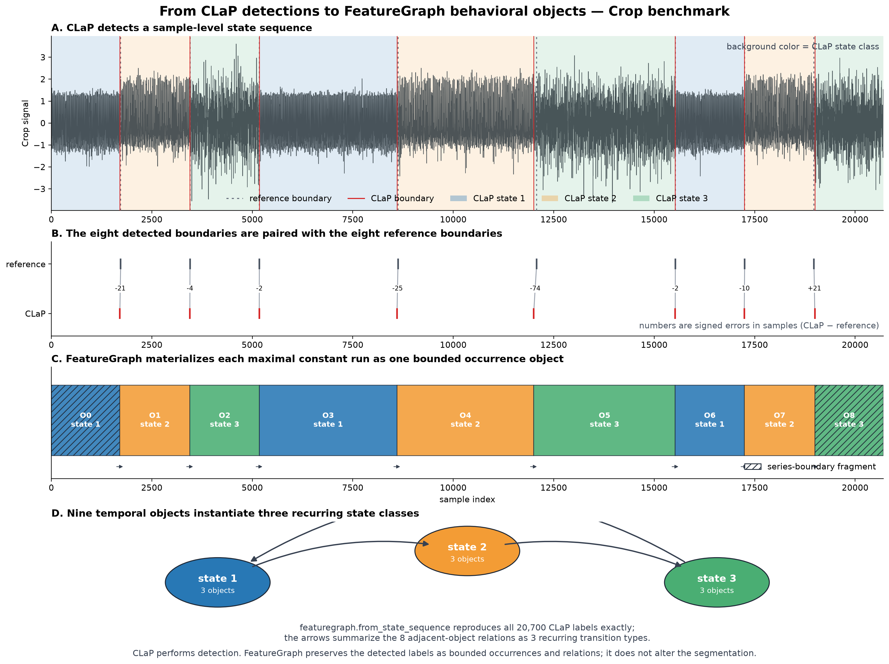

# CLaP state-occurrence object study

**Status:** completed package-integration record  
**Run date:** August 19, 2026  
**Researcher input:** [`notebooks/researcher_input/clap_researcher_input.ipynb`](../../notebooks/researcher_input/clap_researcher_input.ipynb)  
**Generated study:** [`notebooks/generated_study/clap_generated_study.ipynb`](../../notebooks/generated_study/clap_generated_study.ipynb)

## Purpose

This study tests whether an externally inferred state sequence can be preserved
as explicit FeatureGraph behavioral objects. It uses the documented `Crop`
example from ClaSPy and the CLaP method described by Ermshaus, Schäfer, and
Leser in *CLaP - State Detection from Time Series*.

CLaP remains the state detector. FeatureGraph does not smooth, merge, split,
relabel, or reinterpret its output. The public
`featuregraph.from_state_sequence` adapter begins with the returned state
sequence and materializes:

1. observation-level inferred and reference states;
2. state-entry, state-exit, and change-point events;
3. one bounded object per maximal contiguous state occurrence;
4. adjacency relations between consecutive occurrences;
5. object measurements, boundary status, and provenance.

## Frozen development configuration

| Field | Value |
| --- | --- |
| Dataset | `Crop`, Time Series Segmentation Benchmark |
| Loader | `claspy.data_loader.load_tssb_dataset` |
| Detector | `AgglomerativeCLaPDetection` |
| ClaSPy version | 0.2.8 |
| Detector parameters | package defaults |
| FeatureGraph materializer | `featuregraph.from_state_sequence` |
| Observations | 20,700 |
| Benchmark window size | 10 samples |

## Object contract

One `clap_state_occurrence` is a maximal contiguous run with a constant CLaP
state label. It uses a half-open interval:

$$
O_i = [s_i, e_i),
$$

where all observations in the interval share one inferred state class. The
entry event at sample zero and every subsequent label change assigns identity:

$$
E_t = [t = 0] \lor [z_t \ne z_{t-1}],
$$

$$
o_t = \sum_{j=0}^{t} E_j - 1.
$$

The first and final occurrences remain explicit series-boundary fragments. An
internal occurrence is complete because detected state changes bound both
sides. The inferred integer label is a nominal recurring class; the occurrence
identifier denotes one temporal instance of that class.

## Development result

| Measure | Result |
| --- | ---: |
| Inferred state classes | 3 |
| Reference change points | 8 |
| CLaP change points | 8 |
| State-occurrence objects | 9 |
| Complete internal occurrences | 7 |
| Boundary fragments retained | 2 |
| Adjacent-occurrence relations | 8 |
| Adjusted Rand index | 0.977131 |
| Adjusted mutual information | 0.959136 |
| Median absolute boundary error | 15.5 samples |
| Maximum absolute boundary error | 74 samples |

The inferred sparse transition graph contains:

$$
1 \rightarrow 2, \qquad 2 \rightarrow 3, \qquad 3 \rightarrow 1.
$$

The object-relation table reproduces exactly those three state-class pairs
across eight adjacent occurrence relations.

## Boundary comparison

| Boundary | Reference index | CLaP index | Signed error | Absolute error |
| ---: | ---: | ---: | ---: | ---: |
| 1 | 1725 | 1704 | -21 | 21 |
| 2 | 3450 | 3446 | -4 | 4 |
| 3 | 5175 | 5173 | -2 | 2 |
| 4 | 8625 | 8600 | -25 | 25 |
| 5 | 12075 | 12001 | -74 | 74 |
| 6 | 15525 | 15523 | -2 | 2 |
| 7 | 17250 | 17240 | -10 | 10 |
| 8 | 18975 | 18996 | 21 | 21 |

The ordered comparison is valid here because CLaP and the reference contain
the same number of change points. A study with unequal counts must declare a
matching rule rather than silently pairing boundaries by position.

## Structural validation

All eleven declared checks passed:

- public FeatureGraph package adapter used;
- raw signal preserved;
- one inferred label per observation;
- one constant inferred state per occurrence;
- occurrence IDs consecutive;
- occurrence durations cover all 20,700 observations exactly once;
- object reconstruction exactly reproduces the CLaP state sequence;
- object starts after the first occurrence equal CLaP change points;
- one relation exists for every adjacent occurrence pair;
- relation state pairs equal CLaP's sparse transition graph;
- first and final boundary fragments retained.

## Interpretation

This result demonstrates lossless object materialization of one CLaP output by
the public FeatureGraph package API. It does not demonstrate that FeatureGraph
detected or improved the states. The
state-class integers are not assigned crop meanings, and the benchmark labels
are treated as reference annotations rather than infallible physical truth.
One series is sufficient to establish the interface and expose boundary
semantics, but not to claim general interoperability.

## Sources

- Arik Ermshaus, Patrick Schäfer, and Ulf Leser. *CLaP - State Detection from
  Time Series*. Proceedings of the VLDB Endowment 19(1), 2025.
  <https://arxiv.org/abs/2504.01783>
- ClaSPy maintained implementation: <https://github.com/ermshaua/claspy>
- CLaP paper artifact and datasets:
  <https://github.com/ermshaua/classification-label-profile>
